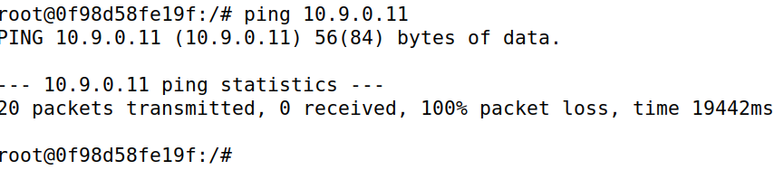
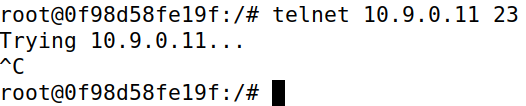

# L3. Linux Firewall Exploration

- [L3. Linux Firewall Exploration](#l3-linux-firewall-exploration)
  - [Task 1: Implementing a Simple Firewall](#task-1-implementing-a-simple-firewall)
  - [Task 1: Implementing a Simple Firewall](#task-1-implementing-a-simple-firewall-1)
    - [Task 1.A: Implement a Simple Kernel Module](#task-1a-implement-a-simple-kernel-module)
    - [Task 1.B: Implement a Simple Firewall Using Netfilter](#task-1b-implement-a-simple-firewall-using-netfilter)
  - [Task 2: Experimenting with Stateless Firewall Rules](#task-2-experimenting-with-stateless-firewall-rules)

## Task 1: Implementing a Simple Firewall

<div>
  

  <p>Un <strong>firewall</strong> es un sistema de seguridad informática diseñado para monitorear y controlar el tráfico de red, actuando como una barrera entre redes confiables y no confiables, como Internet. Su función principal es permitir o bloquear el acceso según un conjunto de reglas previamente configuradas, protegiendo los dispositivos y los datos de posibles amenazas externas. Los firewalls pueden ser hardware, software o una combinación de ambos, y trabajan inspeccionando los paquetes de datos que viajan a través de la red, filtrando aquellos que no cumplen con los criterios de seguridad establecidos.
  </p>
</div>

Además de proporcionar protección contra ataques externos, como intentos de intrusión o malware, los firewalls también pueden gestionar el tráfico interno, previniendo accesos no autorizados dentro de una red corporativa. Con la evolución tecnológica, muchos firewalls modernos incluyen capacidades avanzadas, como la inspección profunda de paquetes (DPI), prevención de intrusiones (IPS), y funciones de control de aplicaciones. Estas herramientas hacen del firewall un componente esencial en cualquier estrategia de ciberseguridad.

## Task 1: Implementing a Simple Firewall

### Task 1.A: Implement a Simple Kernel Module

En este apartado la idea principal es entender el funcionamiento de **LKM** (_Loadable
Kernel Module_). **LKM** es un componente que se puede cargar o descargar dinámicamente en el kernel de un sistema operativo en tiempo de ejecución, sin necesidad de reiniciar. Los LKMs se utilizan comúnmente para extender las funcionalidades del kernel, como controladores de dispositivos o **filtros de red**.

Los pasos a seguir para probar el funcionamiento es con un simple codigo que imprime `Hello World!` y `Bye-bye Wolrd!.`:


```c
   #include <linux/module.h>
   #include <linux/kernel.h>

   int initialization(void)
   {
      printk(KERN_INFO "Hello World!\n");
      return 0;
   }

   void cleanup(void)
   {
      printk(KERN_INFO "Bye-bye World!.\n");
   }

   module_init(initialization);
   module_exit(cleanup);

   MODULE_LICENSE("GPL");
```

1. Ejecutar el comando make, para crear el instalable necesario para realizar las pruebas

   

   ```Makefile
      obj-m += hello.o
      all:
         make -C /lib/modules/$(shell uname -r)/build M=$(PWD) modules
      clean:
         make -C /lib/modules/$(shell uname -r)/build M=$(PWD) clean
   ```

2. Instalar el paquete con el comando `insmod hello.ko`, el archivo será creado en el paso anteior.
3. Con el comando `lsmod | grep hello` podemos buscar el módulo `hello` dentro del listado de módulos y comprobar que esta activo.
4. Con el comando `dmesg` podemos observar que se creó el primer mensaje.

   ```shell
      [11/29/24]seed@VM:~/.../kernel_module$ dmesg
      ...
      [50690.186194] *** LOCAL_OUT
      [50690.186195]     10.0.2.15  --> 91.189.91.98 (TCP)
      [50711.422246] Hello World!
      ...
      [11/29/24]seed@VM:~/.../kernel_module$
   ```

5. Se procede a eliminar el módulo con el comando `rmmod hello`
6. Si volvemos ejecutar el comando `dmesg` podemos observar que en este caso que aparece el segundo texto mencionado al principio de la tarea.
   ```shell
      [11/29/24]seed@VM:~/.../kernel_module$ dmesg
      ...
      [50690.186194] *** LOCAL_OUT
      [50690.186195]     10.0.2.15  --> 91.189.91.98 (TCP)
      [50711.422246] Hello World!
      ...
      [50835.207158] Bye-bye World!.
      [11/29/24]seed@VM:~/.../kernel_module$
   ```

Resumen de comandos ejecutados:
| **Comando** | **Descripción** |
|-------------------------------|------------------------------------------|
| `insmod hello.ko` | Insertar un módulo en el kernel. |
| lsmod grep hello | Listar los módulos cargados y buscar `hello`. |
| `rmmod hello` | Eliminar el módulo del kernel. |
| `dmesg` | Ver mensajes del kernel (incluidos logs de módulos). |

### Task 1.B: Implement a Simple Firewall Using Netfilter

En esta tarea, se implementará un programa de filtrado de paquetes como un **LKM** (_Loadable Kernel Module_) integrado en la ruta de procesamiento de paquetes del kernel de Linux, aprovechando **Netfilter**. **Netfilter** facilita la manipulación de paquetes mediante hooks en el kernel, permitiendo bloquear o modificar paquetes entrantes según políticas de firewall, que pueden ser codificadas directamente en el módulo.

1.  En el primer entregable se nos pide probar el funcionamiento del bloque de paquetes `UDP`, esta funcionalidad ya viene proporcionada en el material de la tarea. Para ello hay que seguir los siguientes pasos:

    

    - Crear (ejecutando `make`) el módulo seedFilter
    - Instalar (ejecutando `insmod seedFilter`) el módulo seedFilter
    - Acto seguido ejecutar el comando `dig @8.8.8.8 www.example.com`. Comprobaremos que no resuelve el paquete.
    - Para más comprobaciones ejecutamos el comando `dmesg` y observamos que se ha bloqueado el paquete.
      ```shell
         ...
         [ 4818.684049] *** Dropping 8.8.8.8 (UDP), port 53
         ...
      ```

2.  Para el segundo entregable se debe conectar la función `printInfo` a todos los hooks de **netfilter**, representados por una serie de macros, donde obtenemos las siguientes deducciones:

    - NF_INET_PRE_ROUTING
      Se invoca cuando un paquete entra en la pila de red, antes de que se tome una decisión de enrutamiento.
      Observaciones: Este hook verá todos los paquetes entrantes, independientemente de su destino final.
    - NF_INET_LOCAL_IN
      Se invoca para los paquetes dirigidos a la máquina local después de que se toman las decisiones de enrutamiento.
      Observaciones: Este hook solo verá los paquetes entrantes dirigidos específicamente a la máquina local.
    - NF_INET_FORWARD
      Se invoca para los paquetes que están siendo reenviados a través de la máquina, pero no destinados a ella.
      Observaciones: Este hook solo verá paquetes en tránsito (no los de entrada/salida local).
    - NF_INET_LOCAL_OUT
      Se invoca para los paquetes originados en la máquina local antes de ser enrutados.
      Observaciones: Este hook verá los paquetes generados por la máquina local.
    - NF_INET_POST_ROUTING
      Se invoca para los paquetes que salen de la pila de red después de que se toman las decisiones de enrutamiento.
      Observaciones: Este hook verá todos los paquetes salientes, ya sean originados localmente o reenviados.

3.  Por último se nos pide implementar dos hooks en **netfilter** para: (1) bloquear que otras máquinas hagan ping y (2) evitar que otras máquinas realicen conexiones Telnet (puerto TCP 23).

- Creamos el código correspondiente al bloqueo de `ICMP`:

  ```c
     unsigned int blockICMP(void *priv, struct sk_buff *skb, const struct nf_hook_state *state) {
        struct iphdr *iph;
        if (!skb) return NF_ACCEPT;
        iph = ip_hdr(skb);

        if (iph->protocol == IPPROTO_ICMP) {
           printk(KERN_INFO "blockICMP: Dropping ICMP packet from %pI4\n", &(iph->saddr));
           return NF_DROP;
        }
        return NF_ACCEPT;
     }
  ```

- Creamos el código correspondiente al bloqueo de `Telnet`:

  ```c
     unsigned int blockTelnet(void *priv, struct sk_buff *skb, const struct nf_hook_state *state) {
        struct iphdr *iph;
        struct tcphdr *tcph;
        u16 telnet_port = 23;
        if (!skb) return NF_ACCEPT;
        iph = ip_hdr(skb);
        if (iph->protocol == IPPROTO_TCP) {
           tcph = tcp_hdr(skb);
           if (ntohs(tcph->dest) == telnet_port) {
                 printk(KERN_INFO "blockTelnet: Dropping Telnet packet from %pI4\n", &(iph->saddr));
                 return NF_DROP;
           }
        }
        return NF_ACCEPT;
     }
  ```

- Registramos ambos filtros:

  ```c
     int registerFilter(void) {
        printk(KERN_INFO "Registering filters.\n");

        ...

        hookICMP.hook = blockICMP;
        hookICMP.hooknum = NF_INET_PRE_ROUTING;
        hookICMP.pf = PF_INET;
        hookICMP.priority = NF_IP_PRI_FIRST;
        nf_register_net_hook(&init_net, &hookICMP);

        hookTelnet.hook = blockTelnet;
        hookTelnet.hooknum = NF_INET_PRE_ROUTING;
        hookTelnet.pf = PF_INET;
        hookTelnet.priority = NF_IP_PRI_FIRST;
        nf_register_net_hook(&init_net, &hookTelnet);

        return 0;
     }
  ```

- Sin olvidar de eliminar los filtros:
  ```c
  void removeFilter(void) {
     printk(KERN_INFO "The filters are being removed.\n");
     ...
     nf_unregister_net_hook(&init_net, &hookICMP);
     nf_unregister_net_hook(&init_net, &hookTelnet);
  }
  ```

Para observar el código completo relacionado al tercer entregable revisar el siguiente [link](./assets/seedFilter.c).

Pasos para la ejecución de código.

1. Ejecutar el comando make, para crear el instalable necesario para realizar las pruebas

   

2. Instalar el paquete con el comando `insmod seedFilter.ko`, el archivo será creado en el paso anteior.

   

3. Con el comando `lsmod | grep seedFilter` podemos buscar el módulo `seedFilter` dentro del listado de módulos y comprobar que esta activo.

   

4. Realizamos el ping y telnet y comprobamos que el funcionamiento no es correcto:

   |               <p align="center"></p>               |               <p align="center"></p>               |
   | :-------------------------------------------------------------------------------------------------: | :-------------------------------------------------------------------------------------------------: |
   |                                    _Ejecución comando **ping**_                                     |                                   _Ejecución comando **telnet**_                                    |
   |  |  |

5. Con el comando `dmesg` podemos observar que se creó el primer mensaje.

   

   ```shell
      root@28dd4b23cf2e:/volumes/packet_filter# dmesg
      ...
      [49646.626481] blockICMP: Dropping ICMP packet from 192.168.60.6
      [49647.652212] blockICMP: Dropping ICMP packet from 192.168.60.6
      [49648.672155] blockICMP: Dropping ICMP packet from 192.168.60.6
      [49649.696406] blockICMP: Dropping ICMP packet from 192.168.60.6
      [49650.723749] blockICMP: Dropping ICMP packet from 192.168.60.6
      [49651.744168] blockICMP: Dropping ICMP packet from 192.168.60.6
      [49652.774113] blockICMP: Dropping ICMP packet from 192.168.60.6
      [49676.591014] *** LOCAL_OUT
      [49676.591016]     10.0.2.15  --> 34.107.243.93 (TCP)
      [49678.191273] blockTelnet: Dropping Telnet packet from 192.168.60.6
      [49679.200896] blockTelnet: Dropping Telnet packet from 192.168.60.6
      ...
      root@28dd4b23cf2e:/volumes/packet_filter#
   
   ```

## Task 2: Experimenting with Stateless Firewall Rules

En este caso, Linux cuenta con un firewall interno muy robusto y versátil basado en **netfilter**, conocido como **iptables**. Este componente es fundamental para gestionar y filtrar el tráfico de red en sistemas operativos basados en Linux, proporcionando un control detallado sobre los paquetes que entran, salen o se reenvían a través de las interfaces de red. **iptables** actúa como una herramienta de línea de comandos que permite configurar reglas específicas para definir cómo debe manejarse cada tipo de tráfico, lo que lo convierte en una opción altamente personalizable y adecuada tanto para usuarios principiantes como para administradores de sistemas avanzados.

El funcionamiento de **iptables** se basa en tablas y cadenas, donde cada tabla contiene un conjunto de cadenas predefinidas para gestionar diferentes aspectos del tráfico de red, como filtrado, traducción de direcciones (NAT) y procesamiento de paquetes no estándar. Estas reglas pueden especificar detalles como la dirección IP, los puertos de origen o destino, y el protocolo utilizado.

Teniendo la idea principal en mente, trabajaremos con el comando <<`iptables`>> que tendrá la siguiente estructura:

| **Tabla** | **Cadena**                                            | **Funcionalidad**                                   |
| --------- | ----------------------------------------------------- | --------------------------------------------------- |
| filter    | `INPUT` `FORWARD` `OUTPUT`                            | Filtrado de paquetes                                |
| nat       | `PREROUTING` `INPUT` `OUTPUT` `POSTROUTING`           | Modificar el origen o el destino direcciones de red |
| mangle    | `PREROUTING` `INPUT` `FORWARD` `OUTPUT` `POSTROUTING` | Modificación del contenido de los paquetes          |

```
iptables -t <table> -<operation> <chain> <rule> -j <target>
---------- -------------------- ------- -----------
  Table          Chain            Rule    Action
```

Para configurar las reglas necesarias para evitar que máquinas externas accedan a la _máquina router_ debemos realizar los siguientes pasos:

1. En primer lugar debemos comprobar que tenemos instalado <<`iptables`>>, mediante el comando:

   

   ```shell
   apt-get install iptables
   ```

2. A continuación ejecutamos los siguientes comandos con permisos de super usuario, esto nos permite la ejecución de comandos <<`ping`>>:

   

   ```
    iptables -A INPUT -p icmp --icmp-type echo-request -j ACCEPT
    iptables -A OUTPUT -p icmp --icmp-type echo-reply -j ACCEPT
   ```

3. Definimos la política predeterminada para INPUT y OUTPUT como DROP, bloqueando todo el tráfico salvo aquel que esté explícitamente autorizado:

   

   ```
     iptables -P OUTPUT DROP
     iptables -P INPUT DROP
   ```

|               <p align="center"></p>                |               <p align="center"></p>                |
| :-------------------------------------------------------------------------------------------------: | :-------------------------------------------------------------------------------------------------: |
|                                    _Ejecución comandos previos_                                     |                               _Resultados ejecución comandos previos_                               |
|  |  |

Como se observa en las capturas solo esta permitido hacer <<`ping`>>
