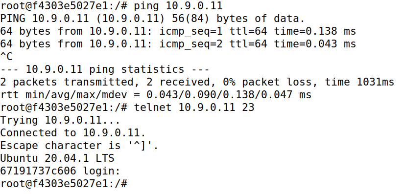
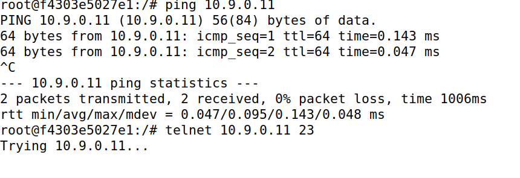

# L3. Linux Firewall Exploration

- [L3. Linux Firewall Exploration](#l3-linux-firewall-exploration)
  - [1. Firewall](#1-firewall)
  - [Task 1: Implementing a Simple Firewall](#task-1-implementing-a-simple-firewall)
  - [Task 2: Experimenting with Stateless Firewall Rules](#task-2-experimenting-with-stateless-firewall-rules)

## 1. Firewall

<div>
  

  <p>Un <strong>firewall</strong> es un sistema de seguridad informática diseñado para monitorear y controlar el tráfico de red, actuando como una barrera entre redes confiables y no confiables, como Internet. Su función principal es permitir o bloquear el acceso según un conjunto de reglas previamente configuradas, protegiendo los dispositivos y los datos de posibles amenazas externas. Los firewalls pueden ser hardware, software o una combinación de ambos, y trabajan inspeccionando los paquetes de datos que viajan a través de la red, filtrando aquellos que no cumplen con los criterios de seguridad establecidos.
  </p>
</div>

Además de proporcionar protección contra ataques externos, como intentos de intrusión o malware, los firewalls también pueden gestionar el tráfico interno, previniendo accesos no autorizados dentro de una red corporativa. Con la evolución tecnológica, muchos firewalls modernos incluyen capacidades avanzadas, como la inspección profunda de paquetes (DPI), prevención de intrusiones (IPS), y funciones de control de aplicaciones. Estas herramientas hacen del firewall un componente esencial en cualquier estrategia de ciberseguridad.

## Task 1: Implementing a Simple Firewall

1. NF_INET_PRE_ROUTING
   Se invoca cuando un paquete entra en la pila de red, antes de que se tome una decisión de enrutamiento.
   Observaciones: Este hook verá todos los paquetes entrantes, independientemente de su destino final.
2. NF_INET_LOCAL_IN
   Se invoca para los paquetes dirigidos a la máquina local después de que se toman las decisiones de enrutamiento.
   Observaciones: Este hook solo verá los paquetes entrantes dirigidos específicamente a la máquina local.
3. NF_INET_FORWARD
   Se invoca para los paquetes que están siendo reenviados a través de la máquina, pero no destinados a ella.
   Observaciones: Este hook solo verá paquetes en tránsito (no los de entrada/salida local).
4. NF_INET_LOCAL_OUT
   Se invoca para los paquetes originados en la máquina local antes de ser enrutados.
   Observaciones: Este hook verá los paquetes generados por la máquina local.
5. NF_INET_POST_ROUTING
   Se invoca para los paquetes que salen de la pila de red después de que se toman las decisiones de enrutamiento.
   Observaciones: Este hook verá todos los paquetes salientes, ya sean originados localmente o reenviados.

## Task 2: Experimenting with Stateless Firewall Rules

En este caso, Linux cuenta con un firewall interno muy robusto y versátil basado en **netfilter**, conocido como **iptables**. Este componente es fundamental para gestionar y filtrar el tráfico de red en sistemas operativos basados en Linux, proporcionando un control detallado sobre los paquetes que entran, salen o se reenvían a través de las interfaces de red. **iptables** actúa como una herramienta de línea de comandos que permite configurar reglas específicas para definir cómo debe manejarse cada tipo de tráfico, lo que lo convierte en una opción altamente personalizable y adecuada tanto para usuarios principiantes como para administradores de sistemas avanzados.

El funcionamiento de **iptables** se basa en tablas y cadenas, donde cada tabla contiene un conjunto de cadenas predefinidas para gestionar diferentes aspectos del tráfico de red, como filtrado, traducción de direcciones (NAT) y procesamiento de paquetes no estándar. Estas reglas pueden especificar detalles como la dirección IP, los puertos de origen o destino, y el protocolo utilizado.

Teniendo la idea principal en mente, trabajaremos con el comando <<`iptables`>> que tendrá la siguiente estructura:

| **Tabla** | **Cadena**                                            | **Funcionalidad**                                   |
| --------- | ----------------------------------------------------- | --------------------------------------------------- |
| filter    | `INPUT` `FORWARD` `OUTPUT`                            | Filtrado de paquetes                                |
| nat       | `PREROUTING` `INPUT` `OUTPUT` `POSTROUTING`           | Modificar el origen o el destino direcciones de red |
| mangle    | `PREROUTING` `INPUT` `FORWARD` `OUTPUT` `POSTROUTING` | Modificación del contenido de los paquetes          |

```
iptables -t <table> -<operation> <chain> <rule> -j <target>
---------- -------------------- ------- -----------
  Table          Chain            Rule    Action
```

Para configurar las reglas necesarias para evitar que máquinas externas accedan a la _máquina router_ debemos realizar los siguientes pasos:

1. En primer lugar debemos comprobar que tenemos instalado <<`iptables`>>, mediante el comando:

   

   ```shell
   apt-get install iptables
   ```

2. A continuación ejecutamos los siguientes comandos con permisos de super usuario, esto nos permite la ejecución de comandos <<`ping`>>:

   

   ```
    iptables -A INPUT -p icmp --icmp-type echo-request -j ACCEPT
    iptables -A OUTPUT -p icmp --icmp-type echo-reply -j ACCEPT
   ```

3. Definimos la política predeterminada para INPUT y OUTPUT como DROP, bloqueando todo el tráfico salvo aquel que esté explícitamente autorizado:

   

   ```
     iptables -P OUTPUT DROP
     iptables -P INPUT DROP
   ```

|                   <p align="center"></p>                   |               <p align="center"></p>                |
| :--------------------------------------------------------------------------------------------------------: | :-------------------------------------------------------------------------------------------------: |
|                                    _Previa ejecución comandos previos_                                     |                               _Resultados ejecución comandos previos_                               |
|  |  |

Como se observa en las capturas solo esta permitido hacer <<`ping`>>
