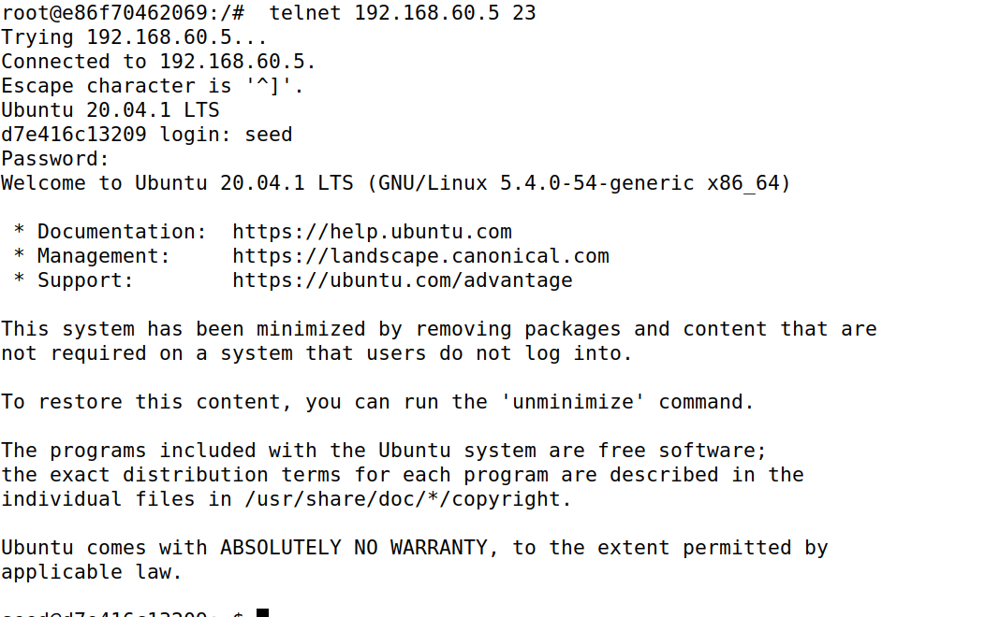
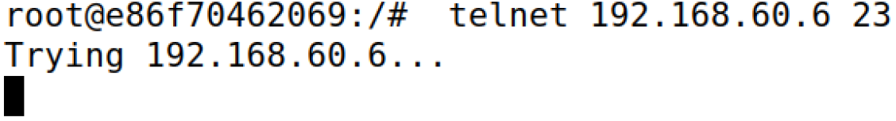
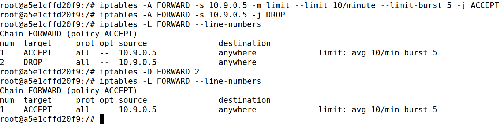
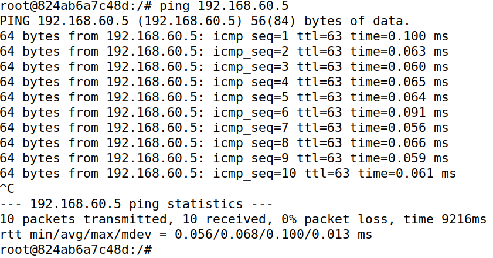
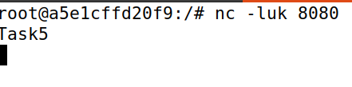
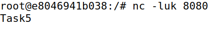
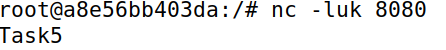
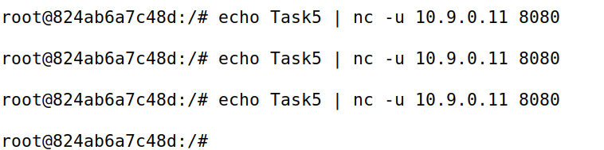
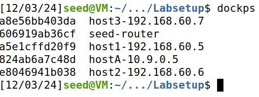

# L3. Linux Firewall Exploration

- [L3. Linux Firewall Exploration](#l3-linux-firewall-exploration)
  - [Task 1: Implementing a Simple Firewall](#task-1-implementing-a-simple-firewall)
  - [Task 1: Implementing a Simple Firewall](#task-1-implementing-a-simple-firewall-1)
    - [Task 1.A: Implement a Simple Kernel Module](#task-1a-implement-a-simple-kernel-module)
    - [Task 1.B: Implement a Simple Firewall Using Netfilter](#task-1b-implement-a-simple-firewall-using-netfilter)
  - [Task 2: Experimenting with Stateless Firewall Rules](#task-2-experimenting-with-stateless-firewall-rules)
    - [Task 2.A: Protecting the Router](#task-2a-protecting-the-router)
    - [Task 2.B: Protecting the Internal Network](#task-2b-protecting-the-internal-network)
    - [Task 2.C: Protecting Internal Servers](#task-2c-protecting-internal-servers)
  - [Task 3: Connection Tracking and Stateful Firewall](#task-3-connection-tracking-and-stateful-firewall)
    - [Task 3.A: Experiment with the Connection Tracking](#task-3a-experiment-with-the-connection-tracking)
    - [Task 3.B: Setting Up a Stateful Firewall](#task-3b-setting-up-a-stateful-firewall)
  - [Task 4: Limiting Network Traffic](#task-4-limiting-network-traffic)
  - [Task 5: Load Balancing](#task-5-load-balancing)
    - [NTH MODE (Round Robin)](#nth-mode-round-robin)
    - [RANDOM MODE](#random-mode)

## Task 1: Implementing a Simple Firewall

<div>
  

  <p>Un <strong>firewall</strong> es un sistema de seguridad informática diseñado para monitorear y controlar el tráfico de red, actuando como una barrera entre redes confiables y no confiables, como Internet. Su función principal es permitir o bloquear el acceso según un conjunto de reglas previamente configuradas, protegiendo los dispositivos y los datos de posibles amenazas externas. Los firewalls pueden ser hardware, software o una combinación de ambos, y trabajan inspeccionando los paquetes de datos que viajan a través de la red, filtrando aquellos que no cumplen con los criterios de seguridad establecidos.
  </p>
</div>

Además de proporcionar protección contra ataques externos, como intentos de intrusión o malware, los firewalls también pueden gestionar el tráfico interno, previniendo accesos no autorizados dentro de una red corporativa. Con la evolución tecnológica, muchos firewalls modernos incluyen capacidades avanzadas, como la inspección profunda de paquetes (DPI), prevención de intrusiones (IPS), y funciones de control de aplicaciones. Estas herramientas hacen del firewall un componente esencial en cualquier estrategia de ciberseguridad.

## Task 1: Implementing a Simple Firewall

### Task 1.A: Implement a Simple Kernel Module

En este apartado la idea principal es entender el funcionamiento de **LKM** (_Loadable
Kernel Module_). **LKM** es un componente que se puede cargar o descargar dinámicamente en el kernel de un sistema operativo en tiempo de ejecución, sin necesidad de reiniciar. Los LKMs se utilizan comúnmente para extender las funcionalidades del kernel, como controladores de dispositivos o **filtros de red**.

Los pasos a seguir para probar el funcionamiento es con un simple codigo que imprime `Hello World!` y `Bye-bye Wolrd!.`:


```c
   #include <linux/module.h>
   #include <linux/kernel.h>

   int initialization(void)
   {
      printk(KERN_INFO "Hello World!\n");
      return 0;
   }

   void cleanup(void)
   {
      printk(KERN_INFO "Bye-bye World!.\n");
   }

   module_init(initialization);
   module_exit(cleanup);

   MODULE_LICENSE("GPL");
```

1. Ejecutar el comando make, para crear el instalable necesario para realizar las pruebas

   

   ```Makefile
      obj-m += hello.o
      all:
         make -C /lib/modules/$(shell uname -r)/build M=$(PWD) modules
      clean:
         make -C /lib/modules/$(shell uname -r)/build M=$(PWD) clean
   ```

2. Instalar el paquete con el comando `insmod hello.ko`, el archivo será creado en el paso anteior.
3. Con el comando `lsmod | grep hello` podemos buscar el módulo `hello` dentro del listado de módulos y comprobar que esta activo.
4. Con el comando `dmesg` podemos observar que se creó el primer mensaje.

   ```shell
      [11/29/24]seed@VM:~/.../kernel_module$ dmesg
      ...
      [50690.186194] *** LOCAL_OUT
      [50690.186195]     10.0.2.15  --> 91.189.91.98 (TCP)
      [50711.422246] Hello World!
      ...
      [11/29/24]seed@VM:~/.../kernel_module$
   ```

5. Se procede a eliminar el módulo con el comando `rmmod hello`
6. Si volvemos ejecutar el comando `dmesg` podemos observar que en este caso que aparece el segundo texto mencionado al principio de la tarea.
   ```shell
      [11/29/24]seed@VM:~/.../kernel_module$ dmesg
      ...
      [50690.186194] *** LOCAL_OUT
      [50690.186195]     10.0.2.15  --> 91.189.91.98 (TCP)
      [50711.422246] Hello World!
      ...
      [50835.207158] Bye-bye World!.
      [11/29/24]seed@VM:~/.../kernel_module$
   ```

Resumen de comandos ejecutados:
| **Comando** | **Descripción** |
|-------------------------------|------------------------------------------|
| `insmod hello.ko` | Insertar un módulo en el kernel. |
| lsmod grep hello | Listar los módulos cargados y buscar `hello`. |
| `rmmod hello` | Eliminar el módulo del kernel. |
| `dmesg` | Ver mensajes del kernel (incluidos logs de módulos). |

### Task 1.B: Implement a Simple Firewall Using Netfilter

En esta tarea, se implementará un programa de filtrado de paquetes como un **LKM** (_Loadable Kernel Module_) integrado en la ruta de procesamiento de paquetes del kernel de Linux, aprovechando **Netfilter**. **Netfilter** facilita la manipulación de paquetes mediante hooks en el kernel, permitiendo bloquear o modificar paquetes entrantes según políticas de firewall, que pueden ser codificadas directamente en el módulo.

1.  En el primer entregable se nos pide probar el funcionamiento del bloque de paquetes `UDP`, esta funcionalidad ya viene proporcionada en el material de la tarea. Para ello hay que seguir los siguientes pasos:

    

    - Crear (ejecutando `make`) el módulo seedFilter
    - Instalar (ejecutando `insmod seedFilter`) el módulo seedFilter
    - Acto seguido ejecutar el comando `dig @8.8.8.8 www.example.com`. Comprobaremos que no resuelve el paquete.
    - Para más comprobaciones ejecutamos el comando `dmesg` y observamos que se ha bloqueado el paquete.
      ```shell
         ...
         [ 4818.684049] *** Dropping 8.8.8.8 (UDP), port 53
         ...
      ```

2.  Para el segundo entregable se debe conectar la función `printInfo` a todos los hooks de **netfilter**, representados por una serie de macros, donde obtenemos las siguientes deducciones:

    - NF_INET_PRE_ROUTING
      Se invoca cuando un paquete entra en la pila de red, antes de que se tome una decisión de enrutamiento.
      Observaciones: Este hook verá todos los paquetes entrantes, independientemente de su destino final.
    - NF_INET_LOCAL_IN
      Se invoca para los paquetes dirigidos a la máquina local después de que se toman las decisiones de enrutamiento.
      Observaciones: Este hook solo verá los paquetes entrantes dirigidos específicamente a la máquina local.
    - NF_INET_FORWARD
      Se invoca para los paquetes que están siendo reenviados a través de la máquina, pero no destinados a ella.
      Observaciones: Este hook solo verá paquetes en tránsito (no los de entrada/salida local).
    - NF_INET_LOCAL_OUT
      Se invoca para los paquetes originados en la máquina local antes de ser enrutados.
      Observaciones: Este hook verá los paquetes generados por la máquina local.
    - NF_INET_POST_ROUTING
      Se invoca para los paquetes que salen de la pila de red después de que se toman las decisiones de enrutamiento.
      Observaciones: Este hook verá todos los paquetes salientes, ya sean originados localmente o reenviados.

3.  Por último se nos pide implementar dos hooks en **netfilter** para: (1) bloquear que otras máquinas hagan ping y (2) evitar que otras máquinas realicen conexiones Telnet (puerto TCP 23).

- Creamos el código correspondiente al bloqueo de `ICMP`:

  ```c
     unsigned int blockICMP(void *priv, struct sk_buff *skb, const struct nf_hook_state *state) {
        struct iphdr *iph;
        if (!skb) return NF_ACCEPT;
        iph = ip_hdr(skb);

        if (iph->protocol == IPPROTO_ICMP) {
           printk(KERN_INFO "blockICMP: Dropping ICMP packet from %pI4\n", &(iph->saddr));
           return NF_DROP;
        }
        return NF_ACCEPT;
     }
  ```

- Creamos el código correspondiente al bloqueo de `Telnet`:

  ```c
     unsigned int blockTelnet(void *priv, struct sk_buff *skb, const struct nf_hook_state *state) {
        struct iphdr *iph;
        struct tcphdr *tcph;
        u16 telnet_port = 23;
        if (!skb) return NF_ACCEPT;
        iph = ip_hdr(skb);
        if (iph->protocol == IPPROTO_TCP) {
           tcph = tcp_hdr(skb);
           if (ntohs(tcph->dest) == telnet_port) {
                 printk(KERN_INFO "blockTelnet: Dropping Telnet packet from %pI4\n", &(iph->saddr));
                 return NF_DROP;
           }
        }
        return NF_ACCEPT;
     }
  ```

- Registramos ambos filtros:

  ```c
     int registerFilter(void) {
        printk(KERN_INFO "Registering filters.\n");

        ...

        hookICMP.hook = blockICMP;
        hookICMP.hooknum = NF_INET_PRE_ROUTING;
        hookICMP.pf = PF_INET;
        hookICMP.priority = NF_IP_PRI_FIRST;
        nf_register_net_hook(&init_net, &hookICMP);

        hookTelnet.hook = blockTelnet;
        hookTelnet.hooknum = NF_INET_PRE_ROUTING;
        hookTelnet.pf = PF_INET;
        hookTelnet.priority = NF_IP_PRI_FIRST;
        nf_register_net_hook(&init_net, &hookTelnet);

        return 0;
     }
  ```

- Sin olvidar de eliminar los filtros:
  ```c
  void removeFilter(void) {
     printk(KERN_INFO "The filters are being removed.\n");
     ...
     nf_unregister_net_hook(&init_net, &hookICMP);
     nf_unregister_net_hook(&init_net, &hookTelnet);
  }
  ```

Para observar el código completo relacionado al tercer entregable revisar el siguiente [link](./assets/seedFilter.c).

Pasos para la ejecución de código.

1. Ejecutar el comando make, para crear el instalable necesario para realizar las pruebas

   

2. Instalar el paquete con el comando `insmod seedFilter.ko`, el archivo será creado en el paso anteior.

   

3. Con el comando `lsmod | grep seedFilter` podemos buscar el módulo `seedFilter` dentro del listado de módulos y comprobar que esta activo.

   

4. Realizamos el ping y telnet y comprobamos que el funcionamiento no es correcto:

   |               <p align="center"></p>               |               <p align="center"></p>               |
   | :-------------------------------------------------------------------------------------------------: | :-------------------------------------------------------------------------------------------------: |
   |                                    _Ejecución comando **ping**_                                     |                                   _Ejecución comando **telnet**_                                    |
   |  |  |

5. Con el comando `dmesg` podemos observar que se creó el primer mensaje.

   

   ```shell
      root@28dd4b23cf2e:/volumes/packet_filter# dmesg
      ...
      [49646.626481] blockICMP: Dropping ICMP packet from 192.168.60.6
      [49647.652212] blockICMP: Dropping ICMP packet from 192.168.60.6
      [49648.672155] blockICMP: Dropping ICMP packet from 192.168.60.6
      [49649.696406] blockICMP: Dropping ICMP packet from 192.168.60.6
      [49650.723749] blockICMP: Dropping ICMP packet from 192.168.60.6
      [49651.744168] blockICMP: Dropping ICMP packet from 192.168.60.6
      [49652.774113] blockICMP: Dropping ICMP packet from 192.168.60.6
      [49676.591014] *** LOCAL_OUT
      [49676.591016]     10.0.2.15  --> 34.107.243.93 (TCP)
      [49678.191273] blockTelnet: Dropping Telnet packet from 192.168.60.6
      [49679.200896] blockTelnet: Dropping Telnet packet from 192.168.60.6
      ...
      root@28dd4b23cf2e:/volumes/packet_filter#

   ```

## Task 2: Experimenting with Stateless Firewall Rules

En este caso, Linux cuenta con un firewall interno muy robusto y versátil basado en **netfilter**, conocido como **iptables**. Este componente es fundamental para gestionar y filtrar el tráfico de red en sistemas operativos basados en Linux, proporcionando un control detallado sobre los paquetes que entran, salen o se reenvían a través de las interfaces de red. **iptables** actúa como una herramienta de línea de comandos que permite configurar reglas específicas para definir cómo debe manejarse cada tipo de tráfico, lo que lo convierte en una opción altamente personalizable y adecuada tanto para usuarios principiantes como para administradores de sistemas avanzados.

El funcionamiento de **iptables** se basa en tablas y cadenas, donde cada tabla contiene un conjunto de cadenas predefinidas para gestionar diferentes aspectos del tráfico de red, como filtrado, traducción de direcciones (NAT) y procesamiento de paquetes no estándar. Estas reglas pueden especificar detalles como la dirección IP, los puertos de origen o destino, y el protocolo utilizado.

### Task 2.A: Protecting the Router

Teniendo la idea principal en mente, trabajaremos con el comando <<`iptables`>> que tendrá la siguiente estructura:

| **Tabla** | **Cadena**                                            | **Funcionalidad**                                   |
| --------- | ----------------------------------------------------- | --------------------------------------------------- |
| filter    | `INPUT` `FORWARD` `OUTPUT`                            | Filtrado de paquetes                                |
| nat       | `PREROUTING` `INPUT` `OUTPUT` `POSTROUTING`           | Modificar el origen o el destino direcciones de red |
| mangle    | `PREROUTING` `INPUT` `FORWARD` `OUTPUT` `POSTROUTING` | Modificación del contenido de los paquetes          |

```
iptables -t <table> -<operation> <chain> <rule> -j <target>
---------- -------------------- ------- -----------
  Table          Chain            Rule    Action
```

Para configurar las reglas necesarias para evitar que máquinas externas accedan a la _máquina router_ debemos realizar los siguientes pasos:

1. En primer lugar debemos comprobar que tenemos instalado <<`iptables`>>, mediante el comando:

   

   ```shell
   apt-get install iptables
   ```

2. A continuación ejecutamos los siguientes comandos con permisos de super usuario, esto nos permite la ejecución de comandos <<`ping`>>:

   

   ```
    iptables -A INPUT -p icmp --icmp-type echo-request -j ACCEPT
    iptables -A OUTPUT -p icmp --icmp-type echo-reply -j ACCEPT
   ```

3. Definimos la política predeterminada para INPUT y OUTPUT como DROP, bloqueando todo el tráfico salvo aquel que esté explícitamente autorizado:

   

   ```
     iptables -P OUTPUT DROP
     iptables -P INPUT DROP
   ```

|               <p align="center"></p>                |               <p align="center"></p>                |
| :-------------------------------------------------------------------------------------------------: | :-------------------------------------------------------------------------------------------------: |
|                                    _Ejecución comandos previos_                                     |                               _Resultados ejecución comandos previos_                               |
|  |  |

Como se observa en ambas capturas solo esta permitido hacer <<`ping`>>, mientras que en la izquierda tabien se puede hacer <<`telnet`>>.

> [!CAUTION]
> Par eliminar toda configuración entre tarea y tarea se pide ejecutar los siguientes comandos. En este caso se debe ejecutar donde se ejecutasen los comandos anteriores de configuración

```shell
   iptables -F
   iptables -P OUTPUT ACCEPT
   iptables -P INPUT ACCEPT
```

### Task 2.B: Protecting the Internal Network

Para esta tarea, debes configurar reglas de firewall en el router utilizando la cadena FORWARD para proteger la red interna 192.168.60.0/24. Es importante entender que los paquetes en la cadena FORWARD pueden dirigirse tanto hacia la red interna como hacia la red externa.

Para especificar la dirección de los paquetes, debes usar las opciones de interfaz:

- `-i` para los paquetes que entran
- `-o` para los que salen.

Primero, identifica los nombres de las interfaces de red interna y externa ejecutando el comando `ip addr`. Luego, implementa las siguientes restricciones específicas para el tráfico ICMP: bloquear que los hosts externos puedan hacer ping a los hosts internos, permitir que los hosts externos hagan ping al router, permitir que los hosts internos hagan ping a los hosts externos y bloquear cualquier otro tráfico entre las redes interna y externa.

Para aplicar dichas reglas debemos ejecutar el siguiente comando, de tal modo que queden bloqueados aquellas solicitudes de echo `ICMP` desde los hosts externos hacia la red interna.


```shell
iptables -A FORWARD -p icmp --icmp-type echo-request -j DROP
```

Ejecutando el comando ping desde otra máquina se obtiene como resultado:

```shell
root@0f98d58fe19f:/# ping 10.9.0.11
PING 10.9.0.11 (10.9.0.11) 56(84) bytes of data.

--- 10.9.0.11 ping statistics ---
19 packets transmitted, 0 received, 100% packet loss, time 121401ms

root@0f98d58fe19f:/#
```

### Task 2.C: Protecting Internal Servers

Para proteger los servidores TCP en la red interna (192.168.60.0/24), se deben configurar reglas de firewall que permitan a los hosts externos acceder únicamente al servidor Telnet en 192.168.60.5 (puerto 23), bloqueando el acceso a otros hosts internos y servidores. Además, los hosts internos deben tener acceso a todos los servidores internos, pero no deben poder conectarse a servidores externos. No se permite el uso de seguimiento de conexiones, por lo que las reglas deben configurarse únicamente con opciones básicas de `iptables`, utilizando `-p tcp` para especificar el protocolo y los parámetros requeridos. Una vez configuradas las reglas, es necesario limpiar las tablas o reiniciar el contenedor antes de continuar.


```shell
iptables -A FORWARD -d 192.168.60.5 -p tcp --dport 23 -j ACCEPT
iptables -A FORWARD -d 192.168.60.0/24 -j DROP
```

Con los comandos mostradors anteriormente se protegemos la red, de tal modo que solo se podrá cominicarse entre dispositivos dentro de la red. Si alguien de fuera quiere entrar no debe de poder. En el siguiente caso si funciona debido que se está realizando el comando <<`telnet`>> a la 192.168.60.5 que viene a ser la configurada previamente, de otro modo si se pretende acceder a la 192.168.60.6 no debe dejar, como se observa en la captura "_Comprobación conexión 192.168.60.6_".

|                      <p align="center"></p>                       |
| :--------------------------------------------------------------------------------------------------------: |
|                                    _Comprobación conexión 192.168.60.5_                                    |
|  |

|                   <p align="center"></p>                   |
| :-------------------------------------------------------------------------------------------------: |
|                                _Comprobación conexión 192.168.60.6_                                 |
|  |

## Task 3: Connection Tracking and Stateful Firewall

En la tarea anterior, se configuraron firewalls sin estado (stateless), que inspeccionan cada paquete de manera independiente. Sin embargo, los paquetes generalmente no son independientes, ya que pueden formar parte de una conexión `TCP` o ser paquetes `ICMP` desencadenados por otros paquetes. Tratar los paquetes de forma aislada ignora el contexto y puede derivar en reglas de firewall inexactas, inseguras o complejas. Por ejemplo, permitir paquetes `TCP` hacia la red interna solo si se ha establecido previamente una conexión no es fácil con filtros de paquetes sin estado, ya que el firewall no puede determinar si un paquete pertenece a una conexión existente sin información de estado. Al mantener información sobre cada conexión, el firewall se convierte en un firewall con estado (stateful), lo que permite una gestión más precisa y segura del tráfico de red.

### Task 3.A: Experiment with the Connection Tracking

A continuación, se describen los resultados y observaciones de los experimentos realizados para analizar el mecanismo de seguimiento de conexiones (**conntrack**) en el router. Estos experimentos ayudan a comprender cómo se manejan los estados de conexión para los protocolos ICMP, UDP y TCP.

**Experimento con ICMP**

Pasos:

1. Realizar `ping` a la 192.168.60.5 desde la máquina `hostA`
2. A continuación hacer `conntrack -l`, desde la máquina `seed-router`

   ```shell
   root@606919ab36cf:/# conntrack -L
   conntrack v1.4.5 (conntrack-tools): 0 flow entries have been shown.
   root@606919ab36cf:/# conntrack -L
   icmp     1 29 src=10.9.0.5 dst=192.168.60.5 type=8 code=0 id=34 src=192.168.60.5 dst=10.9.0.5 type=0 code=0 id=34 mark=0 use=1
   conntrack v1.4.5 (conntrack-tools): 1 flow entries have been shown.
   root@606919ab36cf:/#

   ```

   De primeras se observa que no se obtiene resultado, pero tras realizar el ping y volver a repetir el proceso se observa que hay un paquete `ICMP`. Por otro lado se debe tener en cuenta que los estados ICMP tienen una duración limitada, típicamente de unos 30 segundos desde el último paquete enviado, tras lo cual se elimina de la tabla de **conntrack**.

**Experimento con UDP**

Pasos:

1. Se inició un servidor UDP en `host1` con `nc -lu 9090`
2. Desde `hosta`, se enviaron paquetes UDP hacia `192.168.60.5` usando `nc -u 192.168.60.5 9090` y se introdujo texto.
   ```shell
   root@824ab6a7c48d:/# nc -u 192.168.60.5 9090
   task 3 udp
   response task 3 udp
   ```
3. Finalmente, se verificó la tabla conntrack en el router usando `conntrack -L`, desde el `host1`:

   ```shell
    root@a5e1cffd20f9:/# nc -lu 9090
    task 3 udp
    response task 3 udp

    root@a5e1cffd20f9:/# conntrack -L
    udp      17 25 src=10.9.0.5 dst=192.168.60.5 sport=54637 dport=9090 src=192.168.60.5 dst=10.9.0.5 sport=9090 dport=54637 mark=0 use=1
    conntrack v1.4.5 (conntrack-tools): 1 flow entries have been shown.
    root@a5e1cffd20f9:/#
   ```

   Aunque UDP no es un protocolo orientado a conexiones, el sistema de seguimiento asigna un estado temporal para cada interacción. Este estado se mantiene típicamente durante 30 segundos a 1 minuto después del último paquete recibido.

**Experimento con TCP**

1. Se inició un servidor TCP en `host1` con `nc -l 9090`.
2. Desde `hosta`, se estableció una conexión TCP hacia `192.168.60.5` con `nc 192.168.60.5 9090` y se enviaron datos.

```shell
root@824ab6a7c48d:/# nc 192.168.60.5 9090
task 3 tcp
response task 3 tcp
```

1. Luego, se verificó la tabla conntrack en el router con `conntrack -L`, desde el `host1`:

```shell
root@a5e1cffd20f9:/# nc -l 9090
task 3 tcp
response task 3 tcp
^C
root@a5e1cffd20f9:/# conntrack -L
tcp      6 58 CLOSE_WAIT src=10.9.0.5 dst=192.168.60.5 sport=43010 dport=9090 src=192.168.60.5 dst=10.9.0.5 sport=9090 dport=43010 [ASSURED] mark=0 use=1
conntrack v1.4.5 (conntrack-tools): 1 flow entries have been shown.
root@a5e1cffd20f9:/#
```

Dado que TCP es un protocolo orientado a conexiones, conntrack realiza un seguimiento detallado de su estado. Incluso después de cerrar la conexión, el estado persiste durante varios minutos para manejar retransmisiones o paquetes retrasados.

### Task 3.B: Setting Up a Stateful Firewall

La explicación de los siguientes comandos es:

- La primera norma definida autoriza el paso de tráfico TCP que pertenece a una conexión ya activa o que guarda relación con una conexión previamente establecida. Este tipo de reglas resulta útil para permitir el flujo de retorno y el tráfico vinculado a conexiones existentes, sin necesidad de establecer normas específicas para cada una de ellas.

  ```
  iptables -A FORWARD -p tcp -m conntrack \ --ctstate ESTABLISHED,RELATED -j ACCEPT
  ```

- La siguiente norma detallada autoriza el paso de tráfico TCP entrante a través de la interfaz eth0 hacia el puerto 8080, pero únicamente para los paquetes SYN que inician una nueva conexión. Este tipo de reglas son comunes al configurar cortafuegos, permitiendo tráfico específico según el estado de la conexión y otros parámetros definidos.

  ```
  iptables -A FORWARD -p tcp -i eth0 --dport 8080 --syn \ -m conntrack --ctstate NEW -j ACCEPT
  ```

- Por último en caso de querer eliminar la configuración se debe ejecutar el siguiente comando:

  ```
  iptables -P FORWARD DROP
  ```

Prueba con los comandos del ejercicio [2.C](#task-2c-protecting-internal-servers):

```
iptables -A FORWARD -d 192.168.60.5 -p tcp --dport 23 -j ACCEPT
iptables -A FORWARD -d 192.168.60.0/24 -j DROP
```

La ventaja de las reglas del 2c es que restringen el acceso, permitiendo únicamente el tráfico desde la dirección 192.168.60.5. Sin embargo, las reglas anteriores permiten un acceso más amplio, lo que representa una desventaja en términos de seguridad.

La principal diferencia entre ambas configuraciones radica en que las reglas del 2c son más estrictas, mientras que las de este ejercicio ofrecen mayor flexibilidad. La elección entre estas configuraciones dependerá de los requerimientos de seguridad y de las necesidades particulares del entorno. La configuración más nueva es más adaptable, mientras que la del 2c es más concreta y podría resultar más sencilla de comprender y gestionar. La opción más adecuada dependerá de las necesidades específicas del sistema.

## Task 4: Limiting Network Traffic

El siguiente comando primero impone una restricción que permite un máximo de 5 paquetes provenientes de la dirección IP especificada. Posteriormente, ajusta la limitación para que no se pueda superar un total de 10 paquetes por minuto desde esa misma IP. De esta forma, se controla de manera más efectiva el flujo de tráfico y se evita una sobrecarga o posibles ataques provenientes de esa dirección IP en particular.

```
iptables -A FORWARD -s 10.9.0.5 -m limit --limit 10/minute --limit-burst 5 -j ACCEPT
iptables -A FORWARD -s 10.9.0.5 -j DROP
```

De este modo se descartan los paquetes adiccionales que provienen de la dirección 10.9.0.5 que no cumplen el límite.

|                   <p align="center"></p>                   |                   <p align="center"></p>                   |
| :-------------------------------------------------------------------------------------------------: | :-------------------------------------------------------------------------------------------------: |
|  |  |

## Task 5: Load Balancing

Se procede a realizar un balanceador de carga de tipo round-robin en el router utilizando como servidores los host 1,2 y 3. De tal forma que cada 3 paquetes que se envien el primero irá al host1, el segundo al host2 y así sucesivamente...

### NTH MODE (Round Robin)

Los comandos a seguir para la implementación de esta tarea son:


```
root@606919ab36cf:/# iptables -t nat -A PREROUTING -p udp --dport 8080 -m statistic --mode nth --every 3 --packet 0 -j DNAT --to-destination 192.168.60.5:8080
root@606919ab36cf:/# iptables -t nat -A PREROUTING -p udp --dport 8080 -m statistic --mode nth --every 3 --packet 1 -j DNAT --to-destination 192.168.60.6:8080
root@606919ab36cf:/# iptables -t nat -A PREROUTING -p udp --dport 8080 -m statistic --mode nth --every 3 --packet 2 -j DNAT --to-destination 192.168.60.7:8080
```


```
nc -luk 8080
```

Por último lanzamos el mensaje con la palabra _Task5_ hacía el router:


```
echo Task5 | nc -u 10.9.0.11 8080
```

Y como resultado se observa que los paquetes se van distribuyendo entre los 3 hosts:

|                   <p align="center"></p>                   |                   <p align="center"></p>                   |                   <p align="center"></p>                   |
| :-------------------------------------------------------------------------------------------------: | :-------------------------------------------------------------------------------------------------: | :-------------------------------------------------------------------------------------------------: |
|                               _Primer mensaje distribuido del router_                               |                              _Segundo mensaje distribuido del router_                               |                               _Tercer mensaje distribuido del router_                               |
|  |  |  |

|                   <p align="center"></p>                   | <p align="center"></p> |
| :-------------------------------------------------------------------------------------------------: | :-------------------------------------------------------------: |
|                                    _Envío de mensajes al router_                                    |        _Visualización de los códigos de máquinas docker_        |
|  |                                                                 |

### RANDOM MODE

El modo de ejecución es exactamente al anterior a diferencia de los comandos que se deben ejecutar en el router.

```
root@606919ab36cf:/# iptables -t nat -A PREROUTING -p udp --dport 8080 -m statistic --mode random --probability 0.2 -j DNAT --to-destination 192.168.60.5:8080
root@606919ab36cf:/# iptables -t nat -A PREROUTING -p udp --dport 8080 -m statistic --mode random --probability 0.5 -j DNAT --to-destination 192.168.60.6:8080
root@606919ab36cf:/# iptables -t nat -A PREROUTING -p udp --dport 8080 -m statistic --mode random --probability 0.3 -j DNAT --to-destination 192.168.60.7:8080
```

Establecemos probabilidades diferentes para observar mejor que se distribuyen de manera aleatoria. En algunas ocasiones, el comando parece no generar respuesta inmediata, lo que obliga a esperar unos segundos antes de que el mensaje sea enviado correctamente. Esta situación refleja el comportamiento impredecible o retrasado en la transmisión del mensaje bajo estas condiciones.
